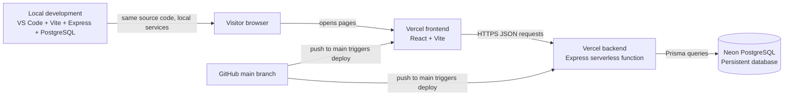
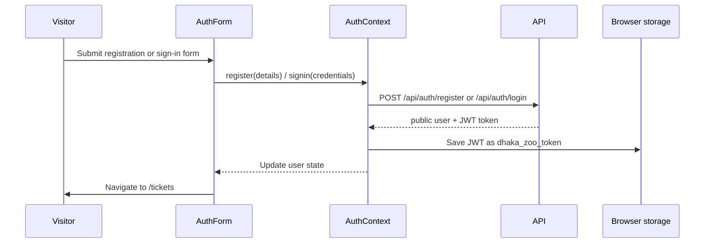
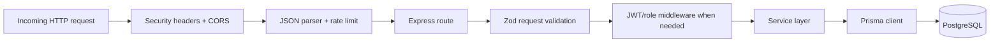
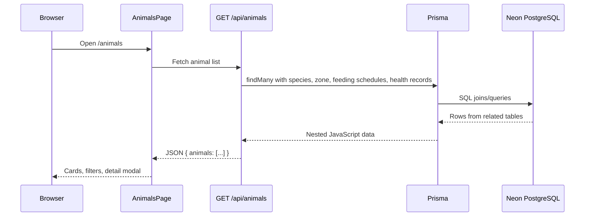
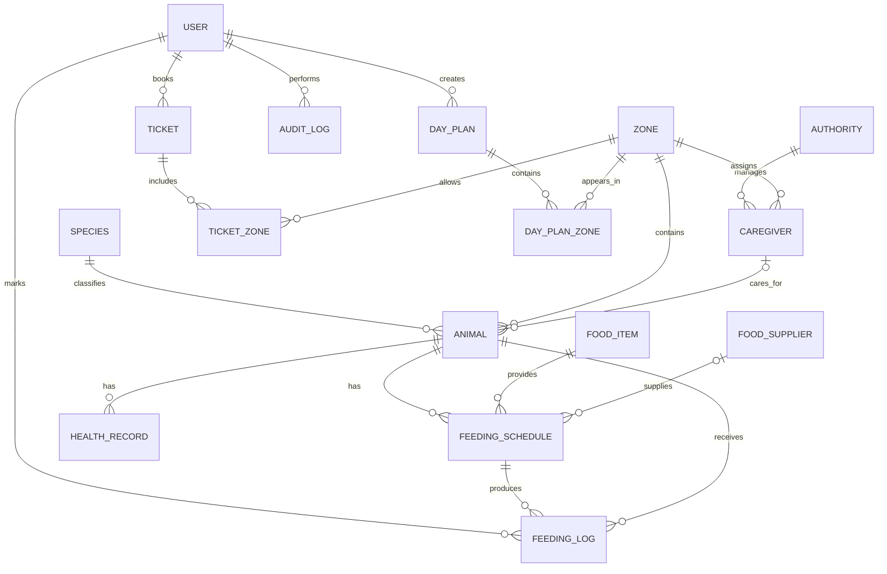
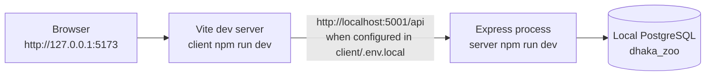
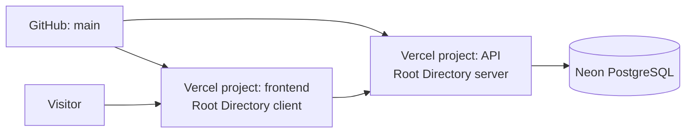

# Dhaka Zoo Management System: Full-Stack Project Guide

This is one full-stack application, not three separate projects. A visitor opens a React website, the website calls an Express API, and the API reads or writes a PostgreSQL database.

> The simplest way to remember it: **frontend shows information, backend enforces rules, database stores facts.**

## 1. System at a glance



### The deployed parts

| Part | Technology | Responsibility |
| --- | --- | --- |
| Frontend | React, Vite, React Router, CSS | Pages, forms, client-side navigation, visual feedback |
| Backend | Node.js, Express, Zod, JWT, bcrypt | API endpoints, validation, authentication, authorization, ticket rules |
| Data access | Prisma + `pg` adapter | Converts JavaScript service calls into PostgreSQL queries |
| Database | Neon PostgreSQL | Durable relational data: users, animals, tickets, feeding records, plans |
| Hosting | Vercel | Static frontend hosting and serverless API execution |
| Source control | GitHub | Stores source history and supplies Vercel deployments |

## 2. Folder map: where to look in VS Code

```text
Dhaka-Zoo-Management-System/
├── client/                         # React frontend
│   ├── src/
│   │   ├── main.jsx                # Starts React in index.html
│   │   ├── App.jsx                 # Routes and protected Tickets route
│   │   ├── api/client.js           # Every browser → API request
│   │   ├── context/AuthContext.jsx # Logged-in user and JWT handling
│   │   ├── pages/                  # Full page components
│   │   └── components/             # Reusable UI pieces
│   └── vercel.json                 # SPA routing and frontend security headers
├── server/                         # Express backend
│   ├── api/index.js                # Vercel serverless entry point
│   ├── index.js                    # Express app, security and route mounting
│   ├── routes/                     # URL → validation → service
│   ├── services/                   # Business logic and database operations
│   ├── middleware/                 # JWT and role checks
│   ├── lib/prisma.js               # Prisma/PostgreSQL connection
│   ├── prisma/schema.prisma        # Database model definition
│   ├── prisma/migrations/          # Database-history SQL files
│   ├── prisma/seed.ts              # Realistic Dhaka Zoo starter data
│   └── vercel.json                 # API function routing
├── README.md                       # Quick start and endpoint list
└── PROJECT_GUIDE.md                # This detailed guide
```

When you want to understand or change a feature, trace it in this order:

1. Find its page or component in `client/src`.
2. Find the API call in `client/src/api/client.js` or that component.
3. Find its route in `server/routes`.
4. Find its rule/query in `server/services`.
5. Find the tables and relations in `server/prisma/schema.prisma`.

## 3. How the frontend works

### React application startup

`client/index.html` contains a single empty container: `<div id="root"></div>`.

`client/src/main.jsx` uses `createRoot(...).render(<App />)` to place the React app into that container. React then owns what is displayed inside it.

`client/src/App.jsx` sets up these browser routes:

| URL | React page | What it does |
| --- | --- | --- |
| `/` | `HomePage` | Featured animals, zones, feeding teaser, visitor information |
| `/animals` | `AnimalsPage` | Loads/searches/filters animals and opens animal details |
| `/register` | `AuthPage mode=register` | Creates a visitor account |
| `/signin` | `AuthPage mode=signin` | Signs in an existing visitor |
| `/tickets` | `TicketsPage` | Shows ticket booking and that visitor's history; requires login |

React Router changes the visible page without requesting a brand-new HTML page from the server. `client/vercel.json` rewrites all frontend paths to `index.html`, which is necessary when someone opens `/animals` directly or refreshes it.

### Components and state

React components are JavaScript functions that return UI. They re-render when their state changes.

For example, `AnimalsPage.jsx` keeps:

- `animals`: records received from the API.
- `loading`: whether the request is still running.
- `error`: an error message if the API cannot be reached.
- `filters`: search, zone, diet, and health values.
- `selectedAnimal`: the item to show in `AnimalDetail` modal.

The page receives all animals once, then filters that array in the browser. The backend also supports filter query parameters, but this particular screen currently filters client-side.

### One frontend API gateway

`client/src/api/client.js` is the browser's common API helper.

```text
component → apiRequest('/animals') → fetch(API_URL + '/animals') → JSON response
```

It also:

- chooses `VITE_API_URL` when configured;
- automatically adds `Content-Type: application/json`;
- automatically adds `Authorization: Bearer <JWT>` when a user is logged in;
- turns a non-2xx response into a readable JavaScript error.

### Authentication on the frontend

`AuthContext.jsx` is shared React state for the signed-in user.



The JWT is stored in `localStorage` under `dhaka_zoo_token`. On a future page refresh, `AuthContext` calls `GET /api/auth/me` with that token. A valid response restores the session; an invalid token is removed and the visitor is signed out.

`ProtectedRoute` in `App.jsx` protects `/tickets`. If no valid user exists, it redirects to `/signin` and returns the visitor to Tickets after a successful login.

## 4. How the backend works

The backend is an Express application in `server/index.js`. Locally, `npm run dev` starts it as a normal Node process. On Vercel, `server/api/index.js` exports the same Express `app` as a serverless function.



### What `server/index.js` does before a route runs

1. Loads environment variables through `dotenv` locally.
2. Creates the Express app.
3. Sets security headers such as CSP, `X-Frame-Options`, and `X-Content-Type-Options`.
4. Checks CORS: only recognized frontend origins may make browser requests.
5. Parses JSON request bodies, up to 1 MB.
6. Applies general rate limiting and tighter authentication rate limiting.
7. Mounts routes under `/api/...`.
8. Returns a clean JSON 404 for unknown URLs and a consistent JSON error for failures.

### Route, validation, service: why the backend has layers

Take animal creation as an example:

```text
POST /api/animals
  → routes/animals.js
  → requireAuth() reads the Bearer JWT
  → requireRole('ADMIN', 'STAFF') checks permission
  → Zod checks name/speciesId/zoneId/date/etc.
  → AnimalService.create()
  → Prisma inserts Animal + related data
  → JSON response returns the new animal
```

This separation is helpful:

- **route**: explains the URL and HTTP method;
- **middleware**: reusable protection;
- **Zod**: rejects invalid data before it reaches the database;
- **service**: business rules and Prisma queries;
- **Prisma**: safely speaks to PostgreSQL.

### Authentication and roles

On registration, the backend never stores the raw password. `bcryptjs` converts it to a slow password hash. Login compares the submitted password against that hash.

If authentication succeeds, the backend signs a JWT containing the user's ID and role. Protected requests send it in this header:

```http
Authorization: Bearer <token>
```

`requireAuth` verifies the JWT and loads the current user. `requireRole` then allows only the needed role:

| Role | Current purpose |
| --- | --- |
| `VISITOR` | Register, log in, view animals, book/view own tickets, create/view own day plans |
| `STAFF` | Create/update animals, create/mark feeding, validate tickets |
| `ADMIN` | Same staff operations plus administrator access |

## 5. API reference in plain language

| Area | Endpoint | Access | Meaning |
| --- | --- | --- | --- |
| Health | `GET /api/health` | Public | Confirms the API is alive |
| Auth | `POST /api/auth/register` | Public | Creates a visitor and returns JWT |
| Auth | `POST /api/auth/login` | Public | Verifies password and returns JWT |
| Auth | `GET /api/auth/me` | Logged in | Restores/reads current user |
| Animals | `GET /api/animals` | Public | Lists animals with species, zone, feeds, health records |
| Animals | `GET /api/animals/:id` | Public | Gets one detailed animal |
| Animals | `POST /api/animals` | Staff/admin | Creates an animal |
| Animals | `PUT /api/animals/:id` | Staff/admin | Updates an animal |
| Zones | `GET /api/zones` | Public | Lists zones and animal counts |
| Tickets | `POST /api/tickets/book` | Logged in | Creates an active ticket and unique code |
| Tickets | `GET /api/tickets/my` | Logged in | Lists the caller's tickets only |
| Tickets | `GET /api/tickets/:id` | Owner/admin | Gets a ticket; visitors cannot read others' tickets |
| Tickets | `POST /api/tickets/validate` | Staff/admin | Verifies a ticket code at a gate |
| Feeding | `GET /api/feeding` | Public | Lists feeding schedule |
| Feeding | `POST /api/feeding` | Staff/admin | Adds a feeding schedule row |
| Feeding | `POST /api/feeding/:id/mark-fed` | Staff/admin | Adds feeding log and updates `lastFedAt` |
| Planner | `POST /api/day-plans` | Logged in | Creates a personal visit plan |
| Planner | `GET /api/day-plans/:date` | Logged in | Gets the caller's plan for one date |
| Planner | `PUT /api/day-plans/:id` | Owner | Updates the caller's plan |
| Enquiry | `POST /api/enquiry` | Public | Returns the current ZooBot placeholder message |

## 6. What happens in a real user action

### A. Viewing animals



### B. Booking a ticket

```mermaid
sequenceDiagram
    participant U as Logged-in visitor
    participant F as TicketBookingForm
    participant A as POST /api/tickets/book
    participant T as TicketService
    participant D as Neon PostgreSQL

    U->>F: Choose type and date; press Book
    F->>A: JWT + { type, visitDate }
    A->>A: Verify JWT and validate Zod input
    A->>T: book(userId, data)
    T->>T: Calculate BDT price and generate unique DZ code
    T->>D: Insert Ticket, optional TicketZone rows
    D-->>T: New ticket
    T-->>F: JSON ticket with qrCode/status
    F-->>U: Booking confirmation and history item
```

### C. Staff marks a feeding event

```text
Staff JWT → POST /api/feeding/:id/mark-fed
         → backend checks STAFF or ADMIN role
         → transaction begins
         → insert FeedingLog
         → update Animal.lastFedAt
         → transaction commits together
```

The transaction matters: either both database changes succeed, or neither is kept.

## 7. Database design: what is stored and why

The database model lives in [server/prisma/schema.prisma](server/prisma/schema.prisma). Prisma uses this file to generate its client and migrations turn changes into PostgreSQL SQL.

### Main relationship map



### Core tables explained

| Table | Stores | Important relations |
| --- | --- | --- |
| `User` | Visitor/staff/admin identity and password hash | Owns tickets, day plans, logs |
| `Species` | Reusable scientific/category information | One species has many animals |
| `Zone` | Habitat/visitor area data | One zone contains many animals |
| `Animal` | Individual resident, e.g. Royal Bengal Tiger | Belongs to one species and one zone |
| `FoodItem` | Reusable food definition | Used by many feeding schedules |
| `FeedingSchedule` | Planned meal/time/quantity | Connects animal to food item |
| `FeedingLog` | A specific meal that really occurred | Points to schedule, animal, marking user |
| `HealthRecord` | A health observation over time | Belongs to one animal |
| `Ticket` | One visitor reservation | Belongs to one user, owns zone links |
| `TicketZone` | Ticket-to-zone join table | Supports many zones per ticket |
| `DayPlan` | A visitor's planned date/notes | Belongs to one user |
| `DayPlanZone` | Ordered zone stops | Supports many zones per plan |
| `Authority`, `Caregiver`, `FoodSupplier` | Operations-management records | Support staff/feeding relationships |
| `AuditLog` | Intended record of important changes | Links optional user to a change |

### Why this is normalized

Normalization means keeping one fact in one appropriate place:

- “Bengal Tiger eats meat” belongs in `Species` / `FoodItem`, not copied as free text for each tiger.
- A zoo zone is stored once in `Zone`, then animals reference it with `zone_id`.
- A ticket can include multiple zones and a zone can belong to many tickets, so `TicketZone` connects them.
- A day plan can include many zones in an order, so `DayPlanZone` holds the extra `visit_order` fact.

This reduces repeated data and makes changes safer. If the Aviary Garden capacity changes, one `Zone` row changes rather than many animal rows.

### Migrations and seed data

- `server/prisma/migrations/` is the database change history. Apply migrations with `npx prisma migrate deploy` in a production-like environment.
- `server/prisma/seed.ts` inserts realistic demo records: 33 animals, 12 species, 7 zones, food, feeding schedules, health records, and local demo accounts.
- Local demo credentials are blocked when `NODE_ENV=production`; production visitors create their own accounts.

## 8. Deployments and environments

### Local development



Your local project folder is [New project](/Users/khaledhasan/Documents/ChatGPT/New%20project). Local environment files are intentionally ignored by Git:

- `server/.env`: database URL, JWT secret, port, allowed local frontend origin.
- `client/.env.local`: `VITE_API_URL` for the local API.

Use two terminals in VS Code:

```bash
# terminal 1
cd server
npm run dev

# terminal 2
cd client
npm run dev
```

### Production



The two Vercel projects must stay separate because this repository has two deployable applications:

| Vercel project | Root directory | Build/result |
| --- | --- | --- |
| `dhaka-zoo-visitor-portal` | `client` | Vite builds `dist`, which Vercel serves as static files |
| `dhaka-zoo-api` | `server` | Vercel runs `api/index.js`, which exports the Express app |

Production secrets belong only in Vercel environment variables:

| Variable | Where | Purpose |
| --- | --- | --- |
| `VITE_API_URL` | Frontend project | Public API address used at build time |
| `DATABASE_URL` | Backend project | Neon connection string; secret |
| `JWT_SECRET` | Backend project | Signs/verifies login tokens; secret |
| `CLIENT_URL` | Backend project | Allowed browser frontend origin for CORS |
| `NODE_ENV=production` | Backend project | Enables production behavior, including demo-account block |

Never commit `.env`, `server/.env`, `client/.env.local`, Neon URLs, or JWT secrets.

## 9. Security you should understand

- Passwords are hashed with bcrypt; raw passwords are not saved.
- JWTs identify the user on protected requests.
- Roles stop visitors from changing animal or feeding data.
- Zod validates input types and required fields.
- CORS allows the known frontend origin, not arbitrary websites.
- Rate limits reduce brute-force and abusive request volume.
- Security headers reduce browser attack surface.
- Vercel/Neon secrets are separate from public GitHub source code.

Security is a process. Before every future deployment: check the Git diff, do not upload secrets, keep 2FA on GitHub/Vercel/Neon, and test both a public page and a protected flow.

## 10. Current requirement status

This table is deliberately honest. “API complete” does **not** mean a visitor can use it in the current UI.

| Requirement area | Backend/data | Frontend UI | Current status |
| --- | --- | --- | --- |
| Vivid minimal public visitor site | N/A | Home, Animals, auth, Tickets | Implemented |
| Animal listing/search/filter/details | `GET /api/animals` | Animal directory + modal | Implemented |
| Visitor registration/login/session | Register/login/me + JWT | Register/sign-in/nav state | Implemented |
| Visitor ticket booking/history | Book/my/get ticket | Booking form + ticket history | Implemented; no real payment gateway |
| Ticket validation | Endpoint + role check | No staff validation UI | Backend ready; UI missing |
| Animal CRUD | GET/POST/PUT, staff/admin protection | No admin animal form/dashboard | Backend ready; UI missing |
| Feeding schedule/logging | GET/POST/mark-fed | Home-page teaser only | Backend ready; operations UI missing |
| Day planning | Create/get/update, ownership enforced | No planner screen | Backend ready; UI missing |
| Health records | Schema + seeded data | Shown only indirectly in animal detail status | Health timeline/CRUD UI missing |
| Audit logs | Schema exists | No audit-writing service or viewer | Not complete |
| ZooBot / Claude integration | Placeholder enquiry response | No chat UI | Not complete |
| Ticket capacity enforcement | No stored procedure/trigger | N/A | Not complete |
| Full Tailwind requirement | CSS custom properties used instead | Existing responsive CSS | Visual goal implemented, Tailwind itself not adopted |

## 11. The best order to finish the project

The next feature should not be chosen only by what is easiest to code. Finish the workflow gaps in dependency order.

1. **Stabilize deployments**: confirm both Vercel projects have the correct roots (`client` and `server`) and test sign-up after every deployment.
2. **Admin/staff dashboard**: sign-in by role, animal create/edit form, ticket validation screen, feeding schedule management, mark-fed action.
3. **Visitor planner**: add a page using the already-existing day-plan API.
4. **Health records**: add staff CRUD API/routes if needed and a health timeline in the animal detail/admin area.
5. **Audit logging**: write an audit record for every staff/admin change and create a read-only viewer.
6. **Ticket capacity rule**: add a database transaction/constraint or stored procedure so a visit date cannot exceed capacity.
7. **ZooBot**: only after the core workflows work; add a controlled server-side Claude/OpenAI integration, never expose an API key to React.
8. **Testing**: expand API tests and add browser-flow tests for register → login → ticket and staff CRUD.

## 12. How to explain this project in a viva or presentation

You can say:

> “Dhaka Zoo Management System is a three-tier full-stack web application. The React frontend is the presentation layer. It calls a secured Express REST API that performs validation, JWT authentication, role-based authorization, and ticket rules. Prisma maps the service layer to a normalized PostgreSQL schema on Neon. Data is organized around animals, species, zones, feeding, tickets, and visitor plans. The frontend and backend deploy independently on Vercel from the same GitHub repository, while sensitive database credentials stay in Vercel environment variables.”

Then demonstrate this sequence:

1. Open Animals and filter Royal Bengal Tigers or a zone.
2. Register a new visitor account.
3. Book a ticket and show its unique code in history.
4. Explain that the same ticket is stored in `Ticket`, linked to that visitor by `user_id`.
5. Explain that staff-only animal and feeding operations exist in the API and are the next UI milestone.

## 13. Quick troubleshooting

| Symptom | Most likely cause | Check first |
| --- | --- | --- |
| Pages load but sign-in/register fails | API URL, backend deployment, CORS, or database environment variable | `GET /api/health`, Vercel API project logs, `VITE_API_URL` |
| Vercel says root directory does not exist | Deployment launched from the wrong local folder or Vercel project root setting is wrong | Frontend root must be `client`; API root must be `server` when deploying through Git |
| Refreshing `/animals` gives 404 | Missing frontend rewrite rule | `client/vercel.json` |
| “Authentication token is required” | No JWT, expired JWT, or browser storage cleared | Sign in again; inspect `AuthContext.jsx` |
| “You do not have permission” | Visitor attempted staff/admin action | Use an authorized staff/admin account and correct endpoint |
| Local app cannot reach backend | Ports/env mismatch | `server/.env`, `client/.env.local`, and both dev terminals |
| Google Safe Browsing warning | Warning belongs to a hostname, not the source code alone | Use the clean hostname; review/report the exact flagged hostname |

## 14. Important final perspective

The project has a solid relational backend foundation and a working visitor path. It is **not yet a complete zoo staff-management product**, because the staff/admin user interface, planner UI, health/audit features, capacity enforcement, and ZooBot are unfinished. That is normal for a staged full-stack project: the database and APIs were built before every operational screen.

Use this guide as the map. When you add a feature, build it vertically: **database/schema → service/API → React UI → test → deploy**. That keeps the project understandable and prevents “frontend-only” features with no real data behind them.
